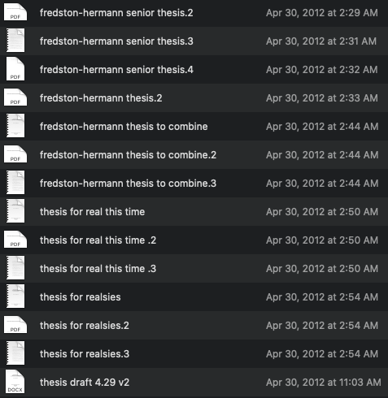
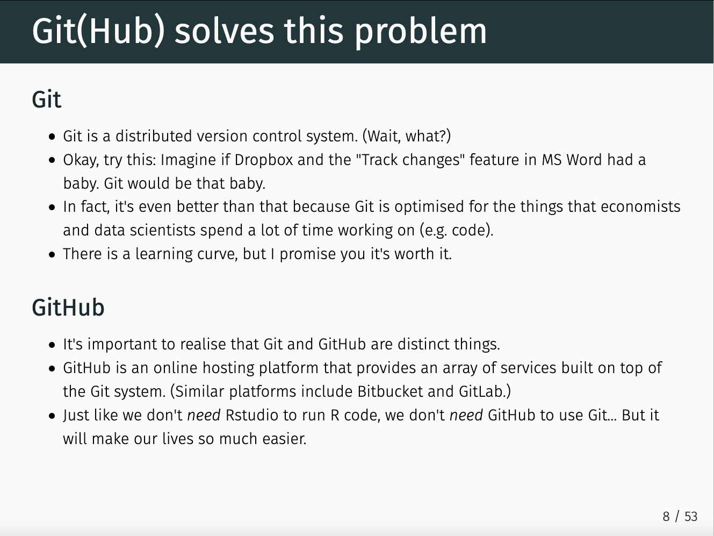
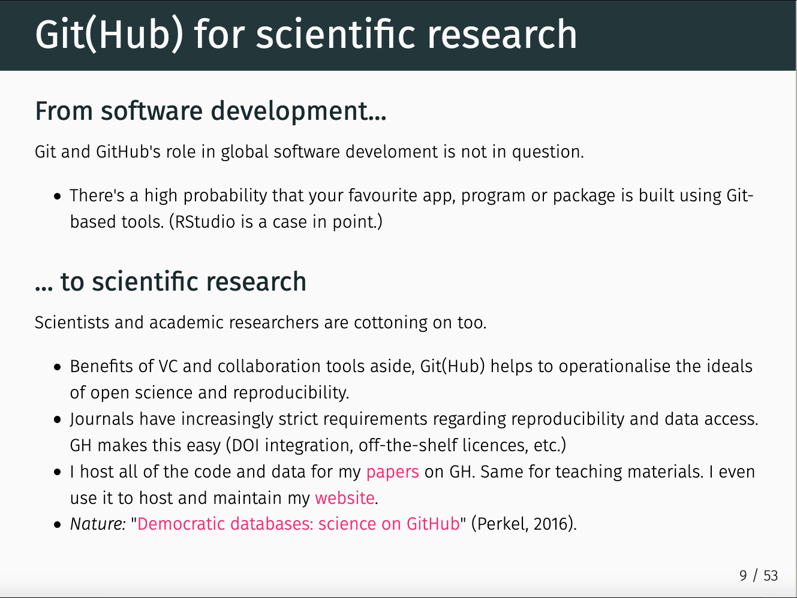

# Introduction

This material was prepared (using [rmarkdown and github](https://github.com/afredston/learn-git)) for a three-hour virtual session to teach Git and Github to a graduate-level course on Advanced Ecological Data Analysis taught at Rutgers University by Malin Pinsky and Rachael Winfree. (However, the only course-specific material is Section 4; the rest should be applicable to any reader.) Feel free to reach out to me at any time; there are lots of ways to get in touch on [my website](www.alexafredston.com).

I prepared this tutorial, but I can't take credit for it! This was created based on materials made public by generous members of the open science community, including: 

* [R for Excel Users by Julie Lowndes (NCEAS) and Allison Horst (UCSB)]( https://rstudio-conf-2020.github.io/r-for-excel/github.html#summary-1) 
* [Happy git with R by Jenny Bryan, RStudio](https://happygitwithr.com/github-acct.html) 
* [Lecture notes by Grant McDermott, University of Oregon](https://raw.githack.com/uo-ec607/lectures/master/02-git/02-Git.html#1) 

## Motivation

There are a number of reasons to transition to a coding workflow that integrates git and github. 

Here's a screenshot of the folder containing my senior thesis drafts from college (just the versions from the night it was due!)



In the words of [Grant McDermott, an economist at the University of Oregon](
https://raw.githack.com/uo-ec607/lectures/master/02-git/02-Git.html#1):




Like Grant, I use github for my [papers](https://github.com/afredston/range-edge-niches), [tutorials](https://github.com/afredston/collaborations_workflows_lecture), and [personal website](https://github.com/afredston/personalwebsite). 

Github and git are often perceived as belonging to software engineers working on huge coding projects. And it's true that those people do use them! As scientists, we often work alone or in small groups, making the need for github as a collaboration platform less obvious. **Today's biggest theme is that you are always collaborating with your past and future selves. If you follow this workflow to make your progress transparent and reproducible, your future self will thank you!**

## Notes 

This introduction to Git and Github from RStudio was designed for an audience of ecologists who are comfortable with R and RStudio, but not necessarily with the command line. That's why this whole tutorial uses point-and-click alternatives to git in the command line. **To repeat: You won't have to type any commands into the black box today** (unless something goes wrong in which case you might). Eventually, some of these workflows (like branching, which you'll learn momentarily) may be simpler to do from Terminal in RStudio, but that's not necessary today. 

We're going to be bouncing back and forth between RStudio and github.com constantly today, so be ready to have both windows open and accessible on your computer.

## Teaching goals

By the end of this tutorial, you should:

* Have git correctly installed on your computer and integrated with RStudio.
* Understand what git and github are and how they interface with RStudio. 
* Be able to create a version controlled R project with a github repository.
* Understand the pull-commit-push workflow, the concept of branches, and how collaboration works. 
* Have a handle on resources to turn to when things go wrong. 
* Have an awareness of some more advanced functions and options in git/github. 

## Setup 

*Before class, please do the following:* 

1. Get git installed on your computer and set up a github account. The best resource for this is [happygitwithr.com](https://happygitwithr.com/github-acct.html). Please follow the instructions for Sections 4, 5, 6, and 7 (ignore 4.3). If you don't use RStudio, I can provide a quick overview during class; I'll be using it exclusively here. 
1. Email me (fredston@rutgers.edu) your github username. 
1. Identify a project of yours for which you've written some code that will be your github guinea pig. You don't need to reorganize anything yet, but please know where the code lives on your computer. 
1. Read [Lowndes *et al.* 2017 *Nature Ecology and Evolution*](https://www.nature.com/articles/s41559-017-0160).

**Please get in touch with me if you have any issues setting up git!**

# Setting up version control

## Creating a repository

Log in to [github](www.github.com) -- you should have created an account already. Also, if you haven't already, accept the invitation to join the aeda2021 organization. 
Set up a repository (from your home page on github.com, not the AEDA2021 organization) by clicking "new", choosing a repository name (no spaces!) and adding a README and a gitignore file. Names should be short, distinct, and relevant to the project you're working on right now; maybe it's `ant-genetics`, `lit_meta_analysis`, or `gutcontentanalysis`? (Don't panic; you can change it later.) Leave the repository public for now so it's easy for us to help you troubleshoot problems, but feel free to make it private later as you're developing your research. I usually keep mine private until I've submitted the associated manuscript or published a preprint. 

This will take you to a page for your new repository. Congratulations! Leave that open in your browser, and head back to RStudio. 

## Creating an R project

R projects link RStudio, git, and github. They're a great way to organize files and manage file paths. R projects are an integral part of the R+git data science ecosystem and I strongly encourage you to use them for all your projects going forward. **You should also open code by going to file -> open project and clicking on the .Rproj file that you are about to learn to generate, rather than opening individual scripts.**

### Sidebar: file paths 

You could, in theory, put this R project anywhere. But I really REALLY think you should create every R project in its own subfolder of a directory called `github` that lives in your root ("home") directory. Why do this? First of all, it'll just organize all your code, and mirror the structure of what you see on github. Second, it makes working across users and machines easier if all your file paths start with `~/github/repo-name`. 

### "Checking out" a repository

Open RStudio. Go to file -> new project -> version control (if you don't see version control, start troubleshooting [here](https://happygitwithr.com/rstudio-see-git.html)) -> git. 

Go back to your browser and the github repo you just created. Click the green button that says "code" and then the clipboard next to the URL. Paste this into the URL box back in RStudio. The directory name is the same as the repository name (`ant-genetics`), and again, I strongly encourage you to create this as a subdirectory of a folder in your root directory called "github".

Great job! You've now created a new R project with version control, in a folder with the same name as your repository. If you had any issues up to this point, there's a walkthrough of this same process with screenshots that could be helpful [here](https://rstudio-conf-2020.github.io/r-for-excel/github.html#create-a-repository-on-github.com). 

## Editing a script 

In the Files pane in RStudio you should see the contents of your new repository. The .Rproj file is very handy; when you want to navigate back here, just use file -> open project in RStudio. 

Open `README.md` and type in a one-sentence summary of this project. Save the changes. 

## The git workflow

There are three core actions that govern version control in git/github:

* **commit**: this "saves" your changes with git (as opposed to ctrl+S which saves them to your local machine -- although you should still do that too). 
* **pull**: this "downloads" any changes to your repository on github, by your collaborators, or your past self on a different machine. 
* **push**: this "uploads" your changes to github.

In the RStudio pane that defaults to "Environment" (should be top right unless you have rearranged the panes), click on the Git tab. If you don't see it, try restarting RStudio and troubleshooting  [here](https://happygitwithr.com/rstudio-see-git.html). This provides a user-friendly way for you to see what files are in this repository, and their version control status. Here's a key to the little color-coded boxes:

* ?: You haven't told git what to do with these files. This is fine, although later we'll talk about a way to suppress these files if they're annoying. 
* M: Modified from previous commit
* A: Added since previous commit
* D: Deleted since previous commit

### Your first commit

In the Git tab we just looked at, you should see an M next to `README.md`. Before you commit, it's good practice to pull first, so go ahead and do that; it should say "up to date" because no one should have made changes to the repository at this stage. 

Now, check the "Staged" box next to README, and click "commit". A new window should pop up that helps you navigate git from RStudio. In the top right box for the commit message, put a short, informative note: maybe "adding project description to readme". Click "commit" and then "push". 

Go back to your browser and reload the page for this repository on GitHub. Do you see the changes you made? 

Look around the repository page for a little bit. It has some helpful information, including the commit message, commit history, and time of last commit for each file. Chat with your partner about how these features and version control in general might be useful for more complex projects. 

### Sidebar: a good commit message 

The content of commit messages is really important because if you need to go back through your code for any reason, they should (if well written) succinctly tell you what each commit accomplished or changed. They often read like subject lines of emails. In the future, I encourage you to take some time to look through other people's repositories (there are some linked later in this tutorial) and see how they approach writing commit messages. 

Congratulations, you've finished setting up git + GitHub + RStudio!

# git and GitHub in practice

In this section, we'll operationalize git and github in your RStudio for real coding and collaboration, and highlight some best practices for this workflow.

## Set up your project repository 

Remember that we named your repository after a project that you want to manage with rstudio + github? Time to get some real science underway! 

Create the following files in the directory for your repository, where your .Rproj and readme live (you can do this either by clicking "new folder" in the "files" tab in RStudio, or with your computer's file browser, like Finder on a Mac):

* `raw-data`
* `scripts`
* `processed-data`
* `results`
* `figures`

Now, put your actual code and data from your actual project in here! (I recommend duplicating the original files just so nothing gets lost.) If one person in your group doesn't have data or code for this project available, please have someone who does share their screen. Here's how I organize these folders:

* `raw-data`: external data that I haven't produced or edited in R, like datasets I collected, got from collaborators, or downloaded. Sometimes these have long file names or are super large or are otherwise gnarly; that's OK. 
* `scripts`: all of your R scripts. If this file gets too long I sometimes separate `scripts` from `figure-scripts` (that just produce plots).
* `processed-data`: data produced by R scripts, e.g., cleaned, tidied, or summarized for analysis (this may be empty right now, that's OK!)
* `results`: output results from your analysis, like model summary files (this may be empty right now, that's OK!)
* `figures`: images generated by R scripts that create plots (this may be empty right now, that's OK!)

Why are we doing this? A well-organized repository will make it much easier for you to keep track of your data, analysis, and results, and will also facilitate version control. 

## Commit your newly added files

Click "commit" under the "git" tab in the top right RStudio pane to bring up the version control window. 

### Sidebar: .gitignore

Now that you've dragged all these files into your directory for this project, you may be seeing a long list of objects with a question mark next to them. **It is not a good idea to select all of them and click "commit".** The most common error that arises here is that github is not intended for file storage. Small datasets and zipped datasets can usually be tracked with no issue, but your repository has a per-file limit of 100mb and an overall recommended limit of 1gb. 

In addition, keep in mind that when you version control files, git is constantly checking for changes in them. This isn't really necessary for, for example, plots generated in your code that you know will change a million times, or pdfs you just keep around for reference. Sometimes I also create scripts that I know I won't keep and never bother pushing them to github, to keep the repository cleaner. 

It's totally fine to just leave files unchecked in the git tab. But -- remember way back when we created this repository, we also created a file called `.gitignore`? If you list files here, they won't come up in the git pane anymore, so you won't have to worry about accidentally checking them. 

Open your .gitignore file. You'll see that it's been auto-populated with a few file types. You can add specific files or just generic file types. If you notice that files haven't vanished from the git pane after you add the file type to .gitignore, try adding an asterisk first. 

On a new line in your gitignore, type "*.png" to suppress version control of any .png image files, and save it.

Save, pull, commit ALL of your changes -- the new gitignore and all of the scripts and datasets you want to version control (with an informative message!), and push your changes. 

## A good workflow with RStudio+GitHub

Let's take a step back. So far, you've learned a ton:

* How to create a repository on github
* How to link it with RStudio R projects 
* How to organize a repository
* How to identify and select files that you want to version control
* How to commit, pull, and push changes

How should these skills actually be integrated into your daily coding practice?

Here are my recommendations:

1. Identify discrete projects associated for your research (for me, these usually correspond to separate papers)
1. Organize each one into a github repository, following the best practices about file paths, repository organization, etc. that we've already discussed
1. Work locally on your computer on files in `scripts`, that may produce objects saved in `results`, `figures`, or `processed-data`
1. Commit when you finish a task, reach a good stopping point, or know you won't come back to a project for awhile. If you have a hard time figuring out where that is, I suggest committing at the end of each work day. (Don't forget to push your changes!)

## Collaborative coding 

It's common to have multiple people working on the same repository. 

Add one of your other group members to your repository on github by going to "settings" and "manage access". Go through the process of setting up an R project with version control in RStudio again, linked to the other person's repository to which you just got granted access. 

You can imagine that if you both create a file called `analysis.R` that contained different code, and tried to commit and push it at the same time, that git would have a problem because it would not be able to reconcile which version to use. This would cause a "merge conflict" (see later section) which we really want to avoid. 

One simple way to avoid this is to just communicate with collaborators about when you are working on code, and when you have pushed changes. This is suitable for small groups on which participants aren't coding continuously. 

But rapidly as projects get more complex, you'll need to create branches and forks -- so read on, and remember that you are always collaborating with your future self!

## Branching 

A common challenge in coding is that you want to make changes to a script, but you want to work through them to some extent before officially changing the code. Some examples of this:

* You want to be able to mess around with a script without screwing up your collaborator, who you know frequently runs that code 
* You're integrating a new dataset into your analysis, adjusting your models, plots, etc., and seeing if it changes your results
* You're testing out better alternatives to scripts you already have (but not wanting to delete the old script immediately)

You can see that some of these situations would arise in a collaborative setting, but many of them just make solo coding "safer" and less likely to break things!

By default, everything that you have committed so far is on the `main` branch of your repository. (This used to be called `master`, so if you see github documentation talking about the master branch, it's the same thing.) You can see this toward the top left of the browser page for the repo on github. If you click on it, you'll see an option to switch branches (but you shouldn't have any others) or to create one. 

Lots of ecologists happily use rstudio+github without ever dealing with branches, and that's fine. But in software development and data science generally, they're *really* common. 


[Photo credit](https://www.nobledesktop.com/learn/git/git-branches)

Don't worry if you don't find this model intuitive; it took me awhile to "get" the branch model used in git, and other people "get" it right away. If you want to explore more visual representations, check out [this interactive site](https://learngitbranching.js.org/?locale=en_US), although keep in mind it is based around using the terminal. 

A key thing to remember about working on a branch is that *you need to retrieve changes from the main branch as you go so that the two are integrable at the end.* Otherwise, you'll end up with a merge conflict (see below). 

### Creating a branch

At this stage, your group will divide into different roles. We're going to be making some changes to the repository created by Student A. Arbitrarily decide amongst yourselves who is Student A and Student B (if your group has more than two people, you can either screenshare or set up multiple pairs.) Student A is the repository creator, and Student B is going to be developing some new code on a branch.

*Disclaimer:* I haven't tried this on two computers, so it's possible you'll get stuck in git / github / rstudio purgatory. I hope not, and we'll definitely help out if that happens, but I thought any surprises that arise should be educational!

On the repository page on github *for Student A* (either one of you can do this), click on "main" on the top left. In the dropdown box, type "development" and click "create branch: development from main". Congratulations, you've just created a branch!

### Editing a branch

**Student B**: You should have already set up Student A's repository with version control on your computer. Open it by double-clicking on its .Rproj file or going to file -> recent projects. git pull; you should get a notification that there is a new branch called "development". To start working on this branch, click the commit button in the git pane in RStudio and select "development" from the dropdown list of branches on the top left. 

Create a new R script called `studentB.R`. Put anything in it that you want; it can just be a comment `#hello` or `#test`. Save it. 

**Meanwhile, Student A**: Open up your repository in RStudio -- the same one that Student B has open -- and git pull. You'll see the development branch, but *stay on the main branch*. Create a new R script called `studentA.R`. Put anything in it that you want; it can just be a comment `#hello` or `#test`. Save it.

Now, *staying on the main branch*, commit `studentA.R`, pull, and push your changes. 

**Student B**: Uh-oh -- you were working on your development branch, and someone made "upstream" changes to the main branch! How can you tell? If you go to github and select the development branch (top left), you'll see a note that says "1 commit behind main". 

It's important to stay on top of this while working on a branch (and it's easy to forget!) so your code doesn't diverge too much from main. 

This is why the branching model is so great: you can just peacefully incorporate the updates Student A has made on the main branch, and keep chugging along on the development branch. 

Many users will do this in the terminal, but I promised you we'd be just using RStudio and GitHub today, so here's a workaround via the `usethis` package (you'll have to install it if you don't already have it): run ```usethis::pr_merge_main()```

Full disclosure: this didn't work on my computer! If you, Student B, run into the same problem that I did, just click the "terminal" tab to the right of "console" (bottom left pane of RStudio if you haven't rearranged it) and type in `git pull origin main` and hit enter. 

If either of those approaches works correctly, you should see a message that one file was added, and see in the project directory that your partner added a script to the repository. 

Now that your development branch is up-to-date, you need to commit your changes to the development branch. Click "commit" to open the git pane, and be sure the branch name (top left) says "development". Commit `studentB.R` to this branch, and push your changes. 

### Merging a branch

Once you've made the changes you wanted (creating `studentB.R`), it's time to merge your changes back into the main branch! In practice, you'd do this when you were finished developing whatever feature you created the branch for. 

This happens via a "pull request", where the developer (Student B) is asking the person managing the main branch (Student A) to accept ("pull") their changes. This might seem unnecessarily formal for our purposes, but it's designed for scenarios where the projects are really complex and not everyone has access to (or wants responsibility for!) managing what gets merged into the main branch and when. 

Go back to github. We haven't really used them yet, but on the home page for your repository, you'll see little tabs along the top (the first is "code"). Click on "pull requests", and "new pull request." Mine shows some "example comparisons", and the first is "development"; click that. It should say "able to merge" at the top. Click "create pull request", and you should see a green check mark next to "able to merge". You can add an extra comment here, although it's not mandatory. Then click "create pull request." 

**Student A:** While you were relaxing, Student B has been hard at work developing some new scripts for your repository! Now, they want to merge their changes back into the main branch. If you go to the pull requests tab (OK, either of you could've done this), you should see a pull request. Click "merge pull request" and "confirm merge": you should see a message that it was successful, and you can delete the development branch safely, since all of its history is now part of main. (Go ahead and delete it if you want, so your repo stays tidy.)

## Forking

Everything we've covered up to now concerns a repository that you've created. But, that's not the only way to get a repository. Sometimes, you want to get your own carbon copy of someone else's repository without having ownership over it or being part of the same organization. Forking isn't a one-way process: you can contribute back to the original repository (and stay up-to-date with its advances) -- see [github's guide](https://guides.github.com/activities/forking/) for more info.

I commonly do this when people publish repositories to accompany research papers (please do this!) and I want to explore their methods and be able to open the code (and possibly re-run it) on my own machine. 

We don't have a tutorial activity for this -- I just wanted you to know it's an option. Here are some fun examples of repositories you might want to fork one day: 

* A [seriously reproducible paper](https://github.com/grantmcdermott/blueparadox)
* Any R package you're curious about the methods for (how about [lme4?](https://github.com/lme4/lme4))
* Someone else's [personal website repo](https://github.com/afredston/personalwebsite), which is the easiest way to make your own!
* [GitHub itself](https://github.com/github/)

## Recap 

Let's recap -- you can now:

* Version control your own projects like a boss
* Add collaborators to a repository
* Create branches or forks for development purposes 

# AEDA2021 homework

This tutorial was designed to teach you a workflow that will work for real research in practice. To cement the core skills of git, GitHub, and RStudio, it's also what Advanced Ecological Data Analysis students will be using to submit all homework assignments. 

Let's go through exactly how that will work. The scripts for each week are stored in [the master repository for this course](https://github.com/aeda2021/2021_master). Take a minute to look around the repository and the [GitHub organization for AEDA 2021](https://github.com/aeda2021). You'll notice there's already a repository for your name. Clone **both** repositories -- `your_name` and `2021_master` -- onto your local machine, following the steps we just learned in part 2.2.2. 

To get the R scripts for the course, you need to manually duplicate them from the `2021_master` repo to the `your_name` repo on your computer (literally duplicate the file in Finder on a Mac or the PC equivalent file browser and drag the duplicate into the folder for the repository in your name). *Don't forget to frequently `pull` in the `2021_master` repo so you see course updates!* To be sure you have the hang of this, duplicate the script `2_github.R` into your personal repo. For your actual homework, you'll edit these scripts; practice now by adding a comment with some text. Save your changes to `2_github.R`, commit them, and push your changes. Check on GitHub to see that the new script has appeared in your personal repo. 

The rest of the tutorial is optional and can be done later or bookmarked for future reference, if you run out of time. 

# Advanced techniques for better science in less time

I've collated some additional material here for your reference. I hope that reading through it, now or later, will give you an idea of resources and concepts out there for your future self. 

## Merge conflicts

I think the #1 reason why people might not feel positively towards git is this all-too-common scenario:

1. You're working contentedly on your local RStudio, and reach a good stopping point in your work. 
1. You commit your changes without a care in the world. 
1. You click "pull" to be safe before pushing your changes, and *you get an error that the version controlled files cannot be merged*. 

These "merge conflicts" arise when you've asked git to incorporate changes that are incompatible with what it has stored from the last commit. Here are some resources for resolving merge conflicts:

* [https://ohshitgit.com/](https://ohshitgit.com/)

Keep in mind that these resources require working from the command line, which we've avoided so far in this tutorial. 

## Best practices for your workflow 

Once you're comfortable with git+github+rstudio in your daily practice, there are a lot of strategies you can use to fine-tune your approach. I gave a presentation on some of these best practices [here](https://github.com/afredston/collaborations_workflows_lecture), and Dan Ovando (UW) has a tutorial on some coding best practices for reproducibility [here](https://github.com/DanOvando/reproducible-workflow). 

## Making the most of GitHub

All of you should sign up for free Github Pro via the [Github Education Pack](https://education.github.com/pack/offers). It comes with a lot of perks that you can read more about.

### Github Issues and Projects

GitHub repositories are more than a great way to organize code (and eventually make it public) with version control. Two really useful features are Issues, which is like a message board where you can keep track of proposed problems, improvements, etc. in your code, and Projects, which is a project organization tool. I haven't used Projects, but I know Issues are a great way to track development and interact with other team members / code users for complex projects -- especially crucial if you want a lot of people to interact with your code, e.g. through an R package (see [VAST example](https://github.com/James-Thorson-NOAA/VAST/issues)). Mark Scheuerell at UW has a great overview of both [here](https://fish497.github.io/website/lectures/week_02/lec_04_intro_github.html#Issues).  

## File paths continued

I mentioned earlier how I organize all of my directories: folders for `scripts`, `processed-data`, etc. In tandem with this approach, I use a phenomenally helpful R package called [here](https://github.com/jennybc/here_here). This simple package uses relative file paths from wherever your .Rproj lives, so if you code `read_csv(here("processed-data","data.csv"))` *it will work wherever this script lives in the directory, on any machine*. I highly recommend it.   

## Further reading and resources

* [Excuse me, do you have a moment to talk about version control? -Jenny Bryan](https://peerj.com/preprints/3159/)
* [Making your code citable](https://guides.github.com/activities/citable-code/)
* [ohshitgit for when things go wrong](https://ohshitgit.com/)
* [A full Software Carpentry git course](https://swcarpentry.github.io/git-novice/)
